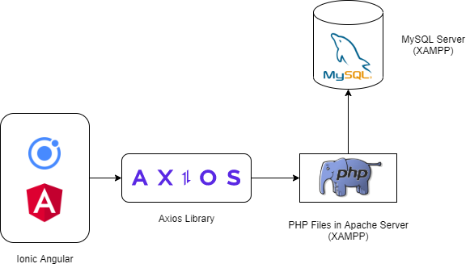
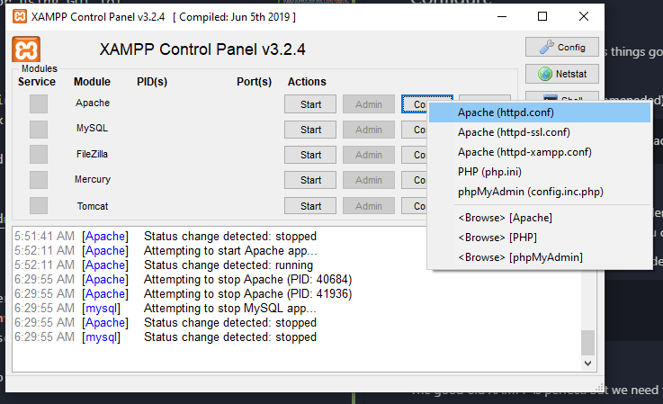
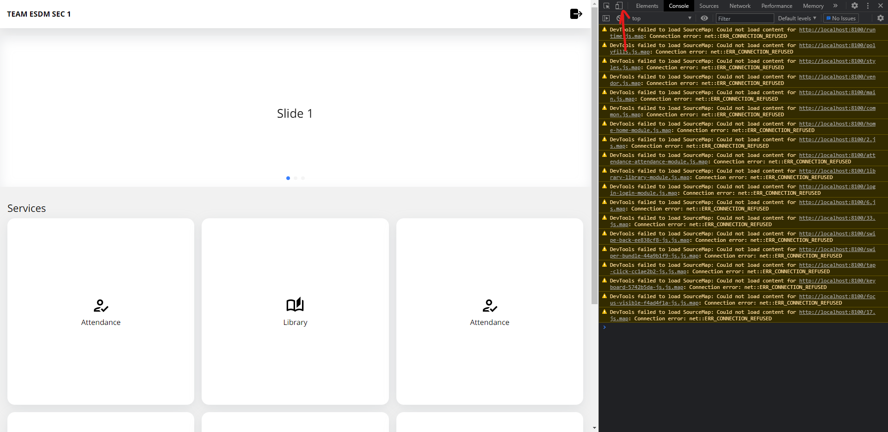
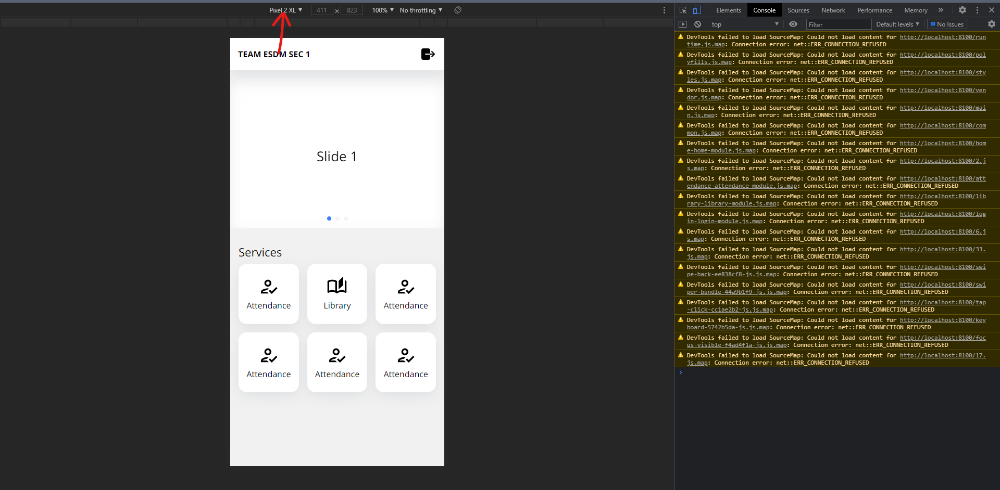
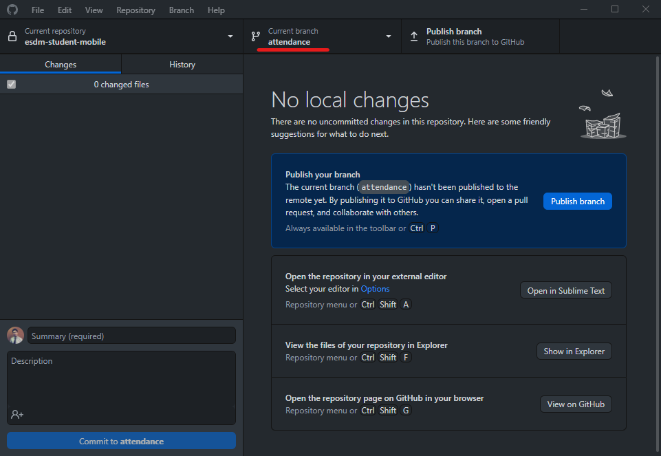

# esdm-student-mobile

## Concept

I guess it's super important to understand how data is flowing here. Instead of giving you a bunch of command to run, here I lay a basic idea of how the technology stack interact with each other.



Basically, everything we learn in the past transfers. HTML, CSS and JS are used with Ionic Angular to create UI. Web dev skills still applies, so that's pretty convenient.

We communicate with our database by sending HTTP request (handle by [Axios](https://github.com/axios/axios)) to the Apache Server. Via PHP, we can then perform our SQL queries.

If you wonder, why we even care to use Ionic then? Well, Ionic will become handy when we need Native Functionality, for example, Push Notification.

> Yes, you can use any NPM library you see fit. As long as you don't break other other people's module. 👲

## Installation

### NodeJS [Website](https://nodejs.org/en/download/)

(I'm using 14.15.4, but as long as >14 should be ok)

### Ionic [Website](https://ionicframework.com/getting-started)

npm install -g @ionic/cli

### Angular CLI [Website](https://angular.io/cli)

npm install -g @angular/cli

### XAMPP [Website](https://www.apachefriends.org/download.html)

If you uninstalled it previously, say hi to XAMPP again. 🤣

That's pretty much all the the stuff we gonna need to install. Since we are going to use Github for version control, I **highly recommend** you to download [Github desktop](https://desktop.github.com/) instead of just clone the repo in the middle-of-no-where in your PC. That will make Pushing, Pulling and Branching much easier to handle.

> But if you like to use CLI to do everything then, you memang power la. Kalau pakai yang hitam puteh, then ok, you are the man. -Our Beloved DR.

Moral of the story: you're not GUIlty for using GUI lol.

## Configure

### Clone the repo

There are total 3 repo you need:

1. esdm-project
2. esdm-student-mobile
3. esdm-php

You can use Github Desktop (recommended) to clone.

```
git clone https://github.com/JunyaoC/esdm-project
git clone https://github.com/JunyaoC/esdm-student-mobile
git clone https://github.com/JunyaoC/esdm-php
```

### NPM I

We need to start by installing Node Dependencies. Make sure you are running the command in the **esdm-student-mobile** folder, which is the folder where you can see src,tsconfig.json ,package.json and stuff.

If you are in the same folder as you php-folder, you're **not** in the right place.

```
cd esdm-student-mobile
npm i
```

### Configure XAMPP

The good old XAMPP is perfect. But we need to configure the Apache Server to serve files from our repo (the php-folder).



Open XAMPP and click on config, in the drop down select httpd.conf, we are going to change the Document Root Directory. When you click the httpd.conf, a text file will launch. Find this line:


Change the underlined path to your repo's directory. I'm sure you can do this! 💪 Just be careful of the slashes. Windows Machine sometimes has forward slash (\\) in the directory, so please replace with backward slash (/).

> Make sure you point to the correct directory. This is the folder where you can see the php-folder.

At this point you can start XAMPP Apache and MySQL server.

### ~~Import Boilerplate DB~~

~~Once that's done, you will need to import the boilerplate database into MySQL. Visit PhpMyAdmin in your machine after starting Apache and MySQL.~~

We don' need to import database anymore. To access PHPMyAdmin, just go to:

http://185.185.40.33:8081

login with:

username: root

password:root

### Run the Project

Now you finally can take a look at the project. Smash these cmd into your terminal and you should see Ionic CLI choking up.

Login info:

> Username: student <br>
> Password: student

```
cd esdm-student-mobile
ionic serve
```

Remember to use open mobile view during development!

> (press F12 on Google Chrome)





You can change other screen sizes here.

## Committing

Before you do anything, make sure you're on the **correct branch**.
That is pretty important to make sure stuff didn't go haywire.



For instance, look at the underlined path. You can switch branch and bring changes to other branches if so happen you developed in a wrong branch. After you made changes, do commit to the sub-branch (**NOT MAIN**). Honestly I'm not sure how to manage PR at the moment, but, let's keep it simple now (by committing into sub-branch).

## Developing

You can add a page by using the command:

```
ng g page <ur-page-name>

##EXAMPLE:

ng g page attendance
```

And to add your page into the home screen, go to the home.page.ts, and add your route in the service.

- [ ] Maybe we should pre-create all pages.

### I guess that's all for now. Thank you.
